# Lecture 1

## Abstract view of Operating System
> 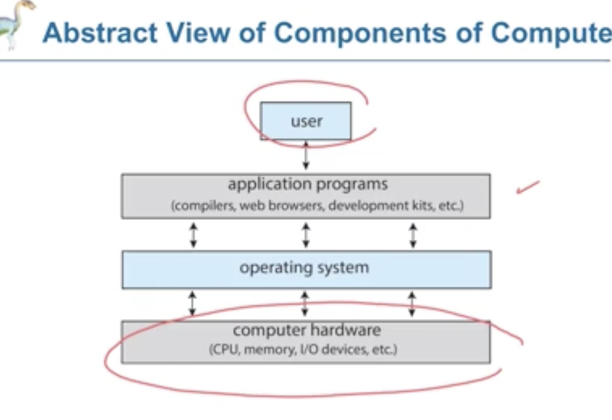 
* A user is able to use an operating system to be able to communicate to the comupter hardware below.

## What is an operating system?
* An intermediary between the user and the computer hardware 
___Goals___
* Convenient to use
* efficient use of computer hardware 
* Manage resources, eg run multiple tasks

An operating system is a ___resource allocator___ and a ___control program___ which makes efficent use of computer hardware to execute programs run by the user.

* Different operating systems within mobile and laptop 
### Real Time embedded Systems/Operating system
* An embedded system will only do one task 
* While an operating system may do numerous tasks 
* Real time embedded systems are time sensetive, and therefore are used for air traffic control, pacemakers. 
* The processing needs to be within a time constraint. 
* There is no universally accepted definition of an ___operating system___
### Parts of a operating system
* Kernal (a program which is always running)
* System program (used to coordinate activities and functions of hardware)
* Application program (applications leaunched by user)
* New operating systems also have middleware, which provide application developers to have access to  services such as databases, multimedia and graphics
* > 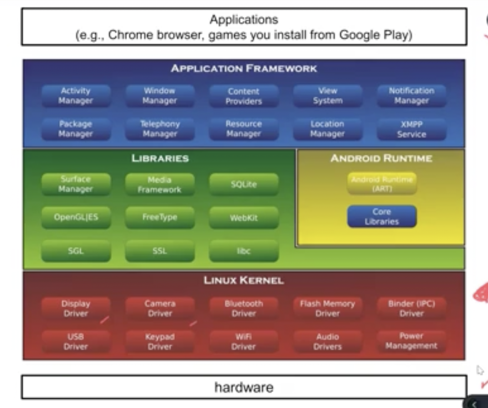 
### Free Software (4 parts)
* Freedom to run for any purpose
* Freedom to study and change the program 
* Freedom to redistribute copies 
* Freedom to change the program and distribute the modifed versions.
### Open source 
* Must comply with 10 criteria 
* Is the source itself, and can be used, however cannot be modified to be distributed.

## Von Neumann architecture
> 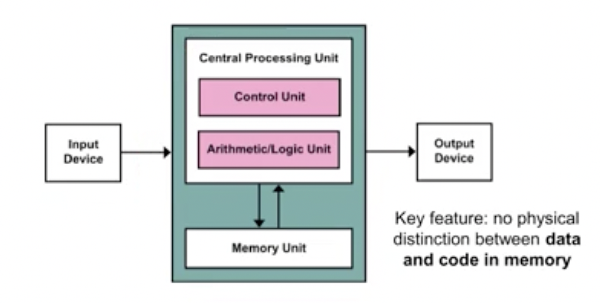 
## Computer Systems
> 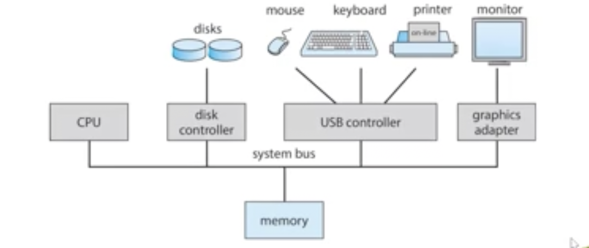 
* Multiple IO devices in the Von Neumann architecture may compete with each other for memory cycles
* This is is communicated by a system bus to allocate the memory.
* We need a ___device controller___ to be in charge of a particular device type  
* Each __device contoller_ _ needs a ___device driver___ to manage it, eg for it to communcaite with other IO devices for connection etc. 
* ___Device-status table___ for containing entries for each I/O device for type, address, state.
### Interupt
* A device controller informs CPU that it has finished its operating by causing an ___interupt___ 
* An operating system is interupt driven. 
* The interrupt transfers control to the interupt service routine through the interupt vector, which contains the addresses of all the service routines.
## CPU and Device Controller
* CPU executes functions one by one, however to the user it looks to be seemless
* > 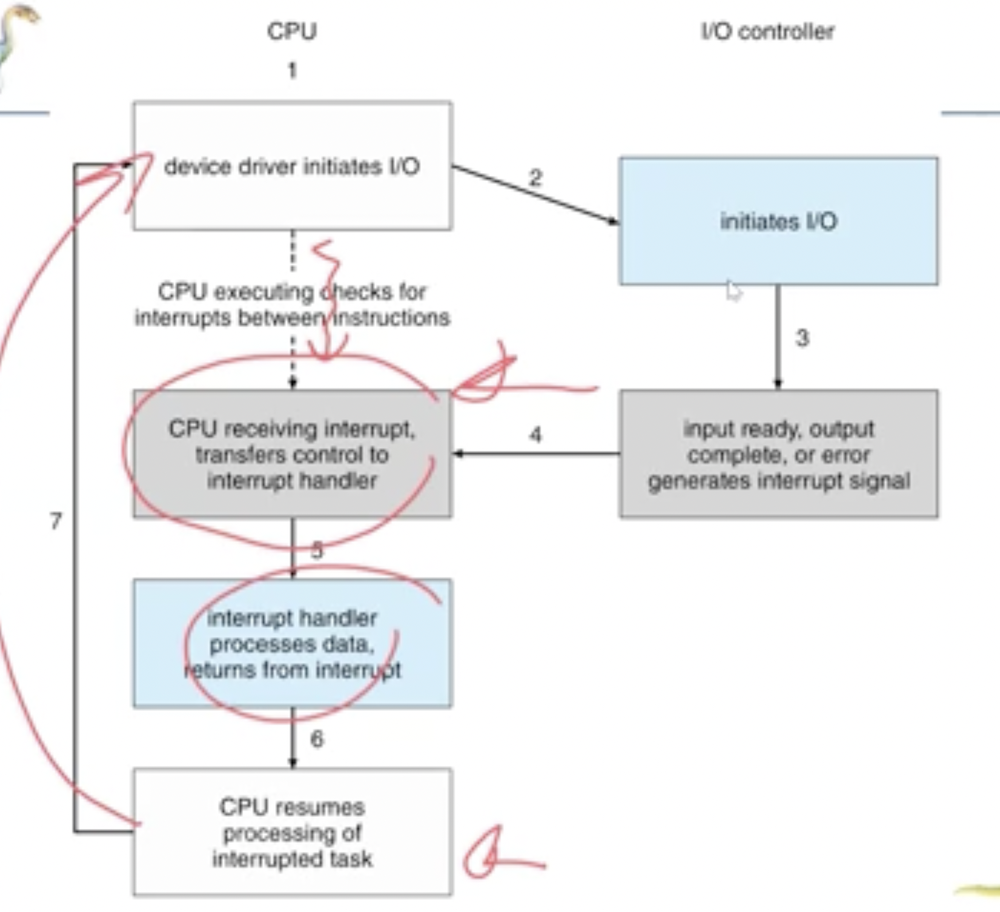 
* This is why the kernal is __Interupt Driven__
* A Hardware interupt may be from a device or __timer__, eg when a process takes too long the timer will be used to interupt.
* A Software interupt may be fron a __exception or trap__, eg when you are dividing by zero or for a __system call__ (where the computer program requests a service from kernal).
### Direct Memory Access Structure
* Used for high speed I/O devices
* Device controller transfers data to memory without the internvention of CPU. 
> 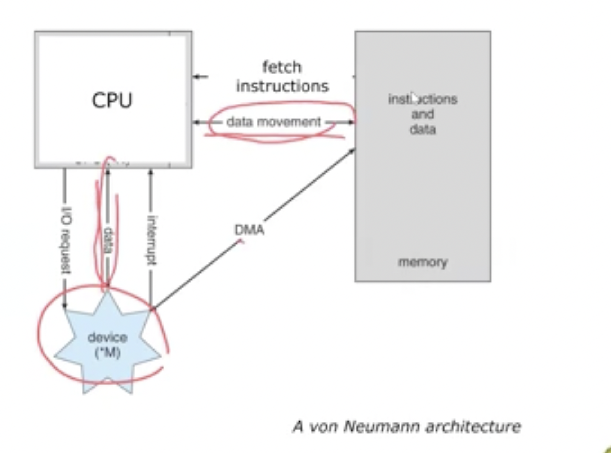 
* Note in the von-neumann structure there is no distrinction between instructions and data.
In the image above, you can see that I/O devices usually go to CPU, to get data. However in direct memeory access the I/O device can access the memeory directly.
### Memory Units
* 1 bit is either 0 or 1
* 1  byte is 8 bits
* 1 word is 4 bytes on a 32 bit platform (can change).
* Kilobyte (kB) 1000 bytes or 1024 bytes 
* Megabyte (MB) = 1024 kilobytes
* Gigabyte (GB) = 1024 megabytes
* Terabyte (TB) = 1024 Gigabytes
* Kilobit per second (kbps) 1000bits/second
### Storage Structure
* Main Memory (CPU is able to directly able to access) 
    * Volatile
    * Random-access memory (any location can be accessed at same time)
* Secondary Memory (Exension of main memory)
  * Non volatile  
> 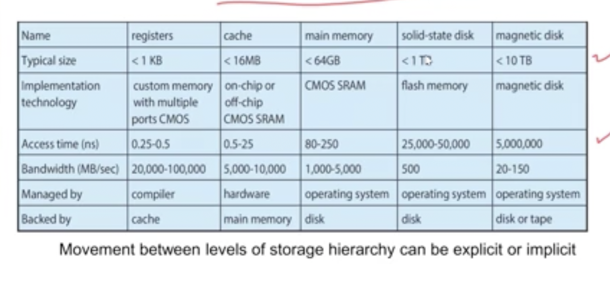 
### Cache 
* If information is in cache, it can be directly used and be fast
* Else the data is copied to cache
Cache management is an important design problem
Cache size and replacement policy 
---
> 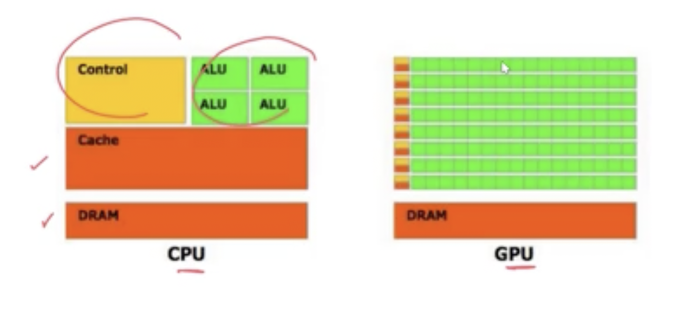 
* CPU is for general purpose usage, while a GPU is for a specialised usage (A GPU will only do one thing).

### Mutiprocessors/Parallel systems/tightly coupled systems
Where they do their own thing concurrently
* Advantages
    * Increased throughput  
    * Can be scaled larger
    * Increased reliability
* Two types
  * Asymmetric Multiprocessing-each processor is given a task
  * Symmetric Multiprocessing- each processor executes all tasks
### Symmetric Architechture
> 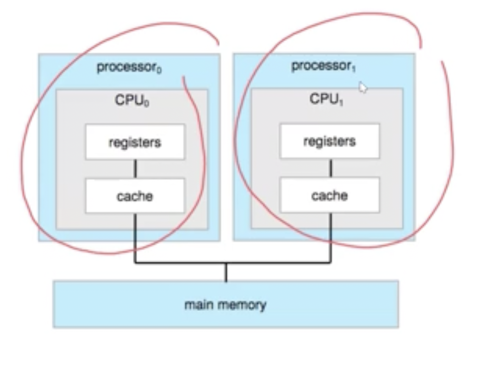 
> (Multiporcessor example)

### Dual-Core Design 
> 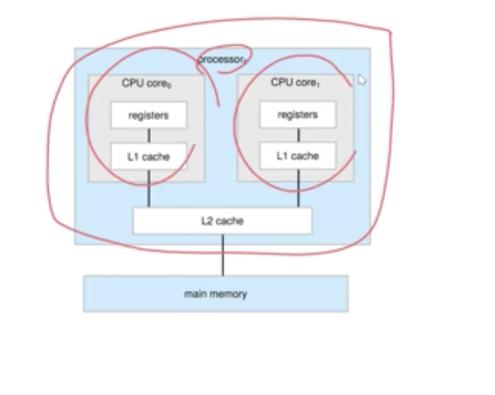
>(Multiple cores example)
* A CPU is hardware that executes instrcutions. And a processor is a chip that contains one or more CPUs. 
### Clustered Systems 
> 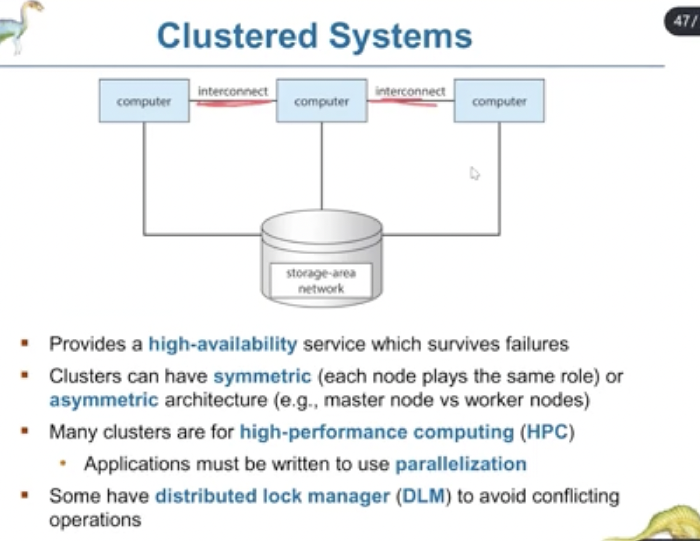
When computers are interconnected
* Clusters can be Asymmetric or Symmetric.
* Many clusters are for high performance computing
### Multi-Programming (running multiple programs, keep CPU busy)
* Multiprogramming organises jobs so the CPU always has somehting to execute
* A subset of total jobs in system is kept in memory, and it is managed by ___job scheduling___.
* When a job has to wait to be executed, the OS switches jobs.
* __Multitasking (timing)__, switch at correct times so that to the user it seems as tho the CPU is working at numerous things at once (even if its not).
### Process Managment
* A process is a program in execution
* program is passive, while a process is an active entity.
### Dual-Mode Operation
* seperates user and kernal, for information that is sensitive
* Some instructions are privileged and only executeable in kernal mode. 
* There is a mode bit, to determine who is asking for instruction 
> 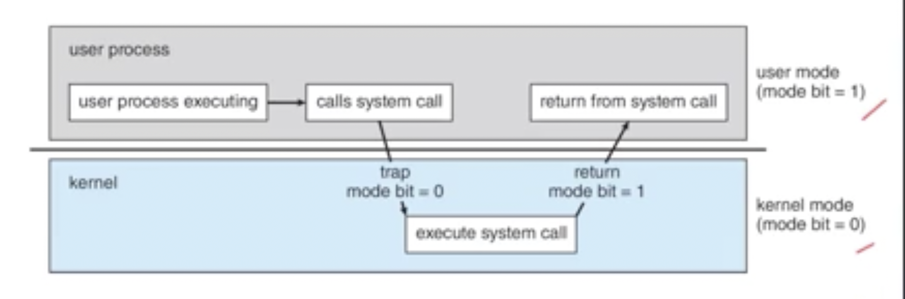
* A system call is used to swtich between user and kernal mode 
### System Boot
* Power turned on -> execution goes to a fixed memory location, (non-volatile).
* At this location a __firmware__ is stored -> performs system check and loads a boot loader (which loads more stuff in the background).
* After this the OS starts running, and the kernal system daemons. 
* Kernal starts GUI or shell. 
# Review
> 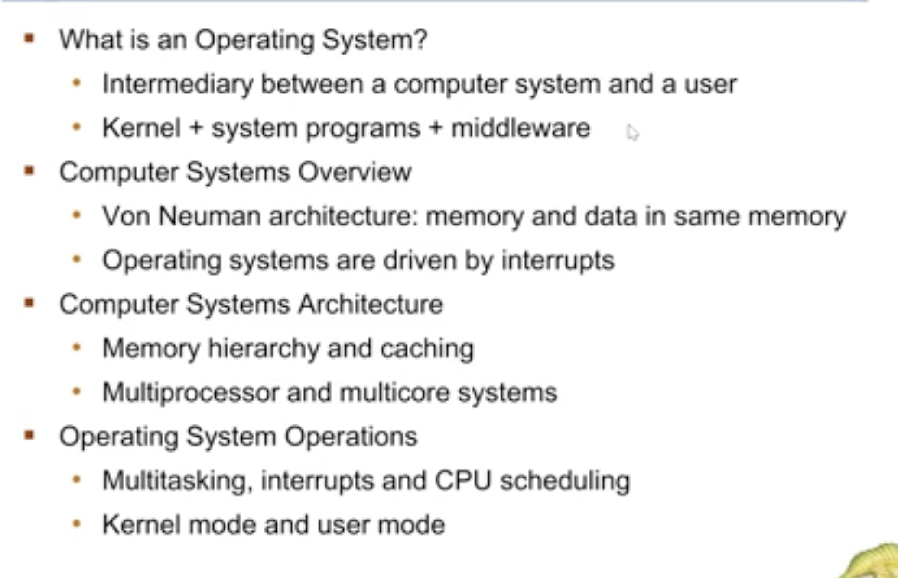

# Part 1B
---
### Operating system services
* User Interface 
* Program execution 
* I/O operations
* File-system manipulation
* Communications 
* Error Detections 
* Interfaces
  * Command Line Interface (CLI)
  * Graphic User Interface (GUI)
  * Touchscreen Interfaces 
  * Batch
* Resource Allocation
* Logging -> keep track of activties from users
* Protection and Security 
  * Protection -> The access to system resources is controlled
  * Security -> The system is safe from outsiders 
## System Calls
* Not called directly
> 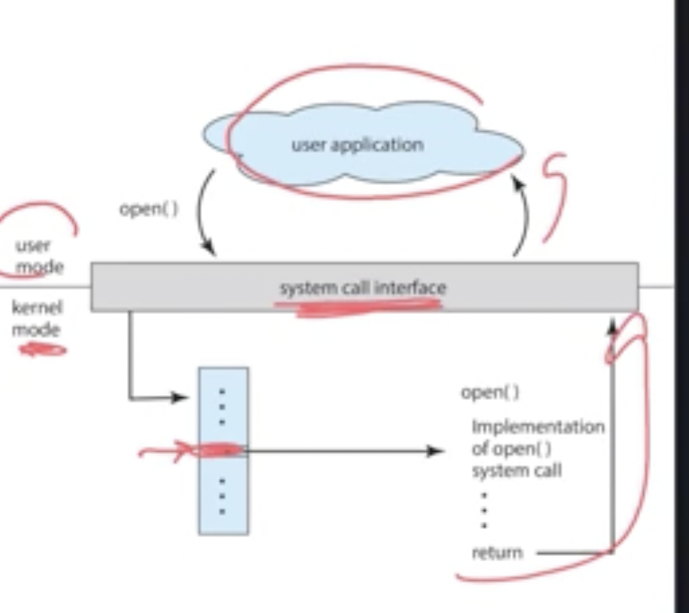
* The user sees none of the call and hence it is called an API
* If inforamtion needs to be passed through Parameters
  * Pass the parameters through resgisters (for small information)
  * Parameters are stored in blocks, and therefore addresses of blocks are passed 
  * Paramters are pushed onto the stack and popped when needed (Stack).
* Types
  * Process Control
  * File Managment
  * Device Managment
  * Information Maintenance
  * Communications
  * Protection
In general a system call is an interface to services provided by an OS
It is Often called internally by programming libraries system programs.
## Design and Implmentation
* User Goals->Should be convintient to use 
* System Goal-> Efficent, Flexible, Error-Free.
* Mostly written in C, C++. 
* The higher level the lanaguage the slower, however it is has more portability.
>Monolithic Structure (Original UNIX operating system)
> 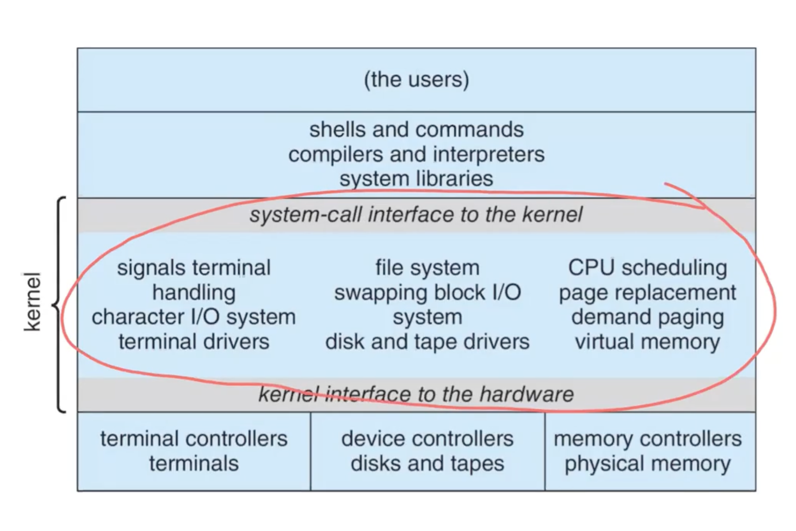