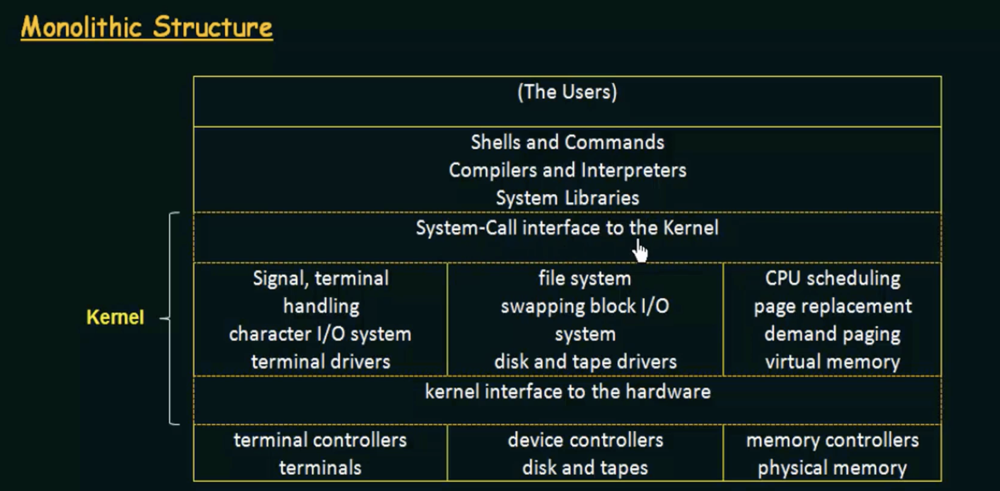
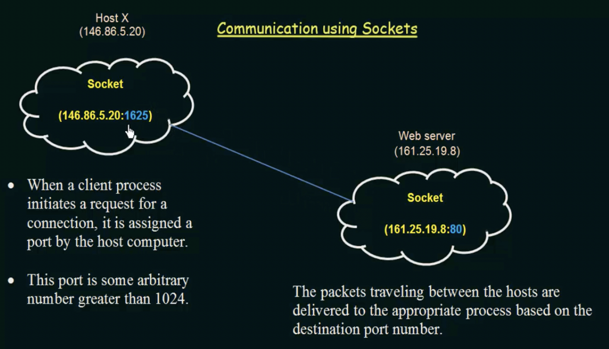
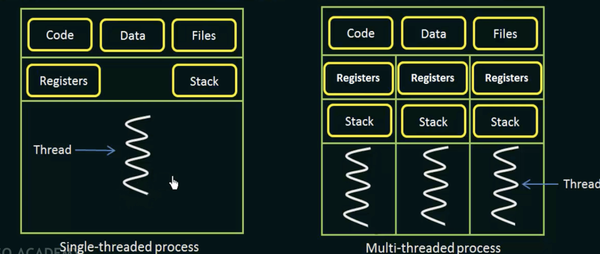
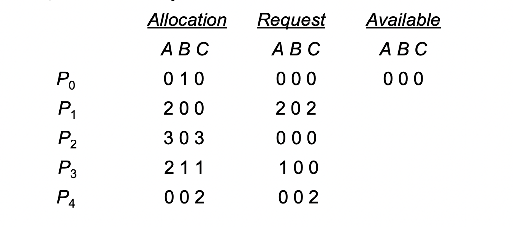

# Video 1 (Introduction)
* AN operating System is a program that manages the computer hardware.
* It also provides a basis for Application Programs and acts as an intermediary between User and computer Hardware. 
>  
### Why do we need an operating systems.
If there is no operating system the user would have to specify each and every task that the computer needs to perform in order to open an application (for example).
People wouldn't use computers. Also operating systems will make the allocation of resources to be efficent. 
# Video 2 (Basics of OS->Computer System Operation)
* A modern general-purpose computer system consists of one or more CPUs and a number of device controllers connected through a common bus to provide access to shared memory.
>>  
* There is an memory controller, which allocates memeory to each device so that the computer runs smoothly.
### Important Terms
> Boostrap program -> The inital program when a computer is powered up
>* Stored in ROM
>* Must know how to load the OS and start executing the system
>* It must locate and load into the memory the OS kernal (kernal is like the heart of the OS and it must be loaded into memory).

> Interupt
> * The occurance of an event is signaled by an interrupt from a haardware or software.
> * The CPU has to stop and has to execute the new task
> * The Hardware will signal an interupt to the CPU  from a system bus.

> System/Monitor Call 
> * Software triggers an interupt by executing a special operation called System call.

* So if it is a hardware interupt -> interupt
* Software Interupt -> Monitor call
### What Happens to CPU after Interupt
> When a CPU gets interupted it stops what it is doing and transfers execution to a fixed location ( the starting address to where the Service Routine of the interupt is located ).
> After execution of the Service Routine the CPU resumes to the previous task 
# Video 3 (Storage Structure)
>>  
> Registers -> stores in bits
> Main memory -> RAM
> Electronic Disk -> Where in the heiracry the secondary storage begins
* Things are loaded into the main memory, for execution even though they are mostly stored in the secondary memory.
* When you have a bigger main memory (i.e MORE RAM means faster process)
# Video 4 (I/O Structure)
* Storage is one of many types of I/O devices within a computer 

* A large portion of the OS is dedicated to managing I/O, because of I/O devices being very different to each other, and how imporatant it is. 
* Each device controller has a device driver
* The device driver translates whatever the device controller splits out, makes it so that the rest of the computer system is able to understand what it is doing.
## I/O operation
* The device driver loads the approiate registers withn the device controller.
* The device controller examines the contents of these registers to determine what action to take.
* The data to what is to be performed it has to be transfered to the __local buffer__ of the device controller.
* Once the transfer of data is complete an interupt from the __device controller__ to the __device driver__
* Once this is complete the device driver returns control to the operating system.
>> 
>> * I/O requet is sent 
>> * data is locded to local buffer via the CPU to the memory
>> * Then the task is done and the data is transfered back to the device.
>> * Then through the interupt the it tells the operating system that it is done with its operation.
* Disadvantage-> It is only good for moving small amounts of data, therefore when moving bulk systems it is very slow. Becasuse the data moves through the CPU , and it keeps getting interupted. 
* Therefore __DMA__ is used
* First three steps are the same, but rather than transfering it through the CPU, it directly to the memory. Therefore only one interupt is generated per block. The interupt only happens to tell the device driver that the operation has completed.
  
# Video 5 (Computer System Architecture)
## Types of computer systems

> * Single Processor System (one general purpose processor)
> One main CPU, with other micro-processors (device specfic tasks) called special purpose processor.

> * Multiprocessor Systems
> * Two or more processors in close communication, and sharing the common bus. Also known  as parallel systems or tightly coupled systems.
>  Economy of scale ->easier to scale, when comapred ot single processoor systems, for example may need one of more single processor for a task, when in multi-processor systems there you are just able to add another processor.
> Increased reliability-> if one fails others are still able to run.

> Types of multiprocessors -> Symmetric and Asymmetric Multiprocessor 
> >> 
> Symmetric -> numerous multiprocessor work together
> Asummetric ->  one main processor which conrtrols all the other processors.

> Clustered Systems -> gather together multiple CPUs
> Different systems are coupled together-> why it is different 
> Can be structed asymmetrically or symmetrically
> Assymmetrically-> one machine is the master while it controls all the other machines
> Symmteric-> Two or more hosts run the applicaitons-> more effiicent 
# Video 6 (Operating system structure)
> In common ->mulitpogramming, time sharing(mutli-tasking).

> Multiprogramming -> A singe user cannot, keep the CPU or the I/O devices busy at all times.
> In multiprogramming we are trying to optimize the CPU, by organizing jobs, so that the CPU always has something to execute.
> The CPU does not remain idle, whenever a job doesnt want to use the CPU, the CPU switches jobs next in the memory.
> No direct communciation

>Time Sharing
> CPU executes mulitple jobs by switching among them
> Numerous users can use the system at the same time, since the switching between the jobs in the CPU happens so quickly that it gives the illustion that the CPU is processing at the same time when it is not.
> There is a direct communciation with the user and the system 
> Uses CPU scheduling and multiprogramming to provide each user with a small portion of a time-shared computer.
> Each user has at least one seperate program in memory 
> A program loaded into memory and executing is called "process".
>> 
# Video 7 (Operating System Services)
<ol>
  <li>User Interface->(Command line interface, Graphical User interface) </li>
  <li>Program Execution </li>
  <li>I/O operations</li>
  <li>File System Management</li>
  <li>Communication between processors (communication between programs) </li>
  <li>Error detection </li>
  <li>Resource Allocation</li>
  <li>Accounting -> what users use what</li>
  <li>Protecttion and Security</li>
</ol>
# Video 8 (User Operating System Interface)
* A system for a user to interact with the computer system.
  
# Video 9 (System Calls)
* System calls provide an interface to the services that are avaiable by an operating system.
> There are two modes, User and Kernal Mode
* If a system is in User mode, it does not have direct access to the memory, hardware(I/O devices) and such resources.
* If a program is running in kernal mode and comes across an error, the whole system crashes.  
* Therefore a user mode is safer for a program to execute, and therefore most programs reside in the user mode. 
> If the program in user mode needs access to resources it makes a call to the operating system, this is where the program is switched from user to kernal mode where it can gain these resouces.-> This is a system call.
* A system call is a programmatic way for a computer program to request a service from the kernal of the operating system. (written in C and C++)
# Video 10 (Types of System Calls)
> __Process Control__
> * end/abort processes -> when error occurs
> * load/execute processes 
> * create/terminate processes
> * get/set process atributes
> * wait for time
> * wait for event/ signal for event
> * Allocate and free memory

> __File Management__ 
> * create/ delete files
> * open/close files
> * read/write/reposition files
> * get/set file attributes

> __Device Manipulation__ -> eg I/O devices
> * request/release device 
> * read/write/reposition device
> * set/get device attribution
> * logically  attach and detach devices -> when the operating system understands when the device has been attached and ready to use (eg a pendrive safe to eject).

> __Information Maintenance__
> set/get time and date
> get/set system data
> get/set process, file and device attributes.

> __Communications__
> create, delete, communcation connection
> send receive messages
> transfer status information
> attach or detach remote access

# Video 11 (System Programs)
* An imporatant aspect of a modern system is the collection of system programs
* System programs provide a convenient environment for program development and execution
> 
> __File Management System Programs__ 
> to create/delete/copy/rename/print/dump/list and generally manipulate files and directories.

> __Status Information__
> Date/Time/Number of users/performacne/debugging information etc.

> __File Modification__ 
> File Modeification is where the user directly changes the inner content of files.
> Edit/Look for text.

>__Programming Langauge Support__
> 1. Compilers 
> 2. Assemblers
> 3. Debuggers
> 4. Interpreters
> There are provided with the operating system to the user

> __Program Loading and execution__
> * Once a program is assembled-> it must be loaded into memory to be executed 
> Therefore systems may provide debuggers for high level lanagues and more

> __Communications__
> * creating virtual connections among processes, users and computer systems
> Allowing users to messages to another systems
> To browse webpages
> To log in to transfer files from one machine to another.

In Addition to system programs, most operating systems are supplied with programs that are useful in solving common problems or performing common operations, such as safari, Internet-web explorer. These are application programs.

# Video 12 (Operating System Design and Implmentation)
> __Design Goals__
> Defining goals and requirements
> * Choice of hardware
> * Type of system 
> Beyond this level the requirents are harder to define
> Requirements-> User, System 
> User -> easy to use
> System Requirement -> Easy to design, and easy to maintain. Error free and efficient.

> Mechanisms -> How to do something
> Policies -> What will be done (Rules)
> The Mechianisms and Policies have to be seperate-> flexibility

> __Implementation__
> Written in C and C++, since....
> * code written faster
> * More compact 
> * Easier to debug 
> * Easier to understand
> * Easier to port

# Video 13 (Structures of Operating Systems)
> __Simple Structure__
> 
> Base drivers here can be accessed by all other programs
> Not a layered structure
> For example since application programs have access to the Hardware, if the program crashes the whole system crashes.

> __Monolothic Structure__
> 
> The problem is that the kernal has too many functions and therefore is very hard to implement, and very difficult to maintain. Since there are too many things packed into one level.

> __Layered Structure__
> 
> This is not as efficeint since when an application wants to access the hardware, it has to go through all the layers to gain access to the hardware

> __Micro-kernals__
> Instead of a big kernal, the unessential programs are removed and are implmented into the user-side (as system programs).
> The micro-kernal communicates between the client program and all the other functionilies
> 

> __Modules__
> Best and most recent-> more flexible
> Advantage, it is loaded dymaically and therefore does not need to be loaded as in micro-kernals.

> 
> Modules are only loaded when it is needed
> Implemented through OOP.

# Video 14 (Virtual Machines)
* To use one computer's hardware to share its resources into different execution enviorments, so that it seems that each of the enviorements are running their own private computer.
> 
> * Virtual machine software(used to actually make a virtual machine) ->Runs in Kernal Mode
> * Virtual Machine Itself i.e could be a different operating system -> Runs in User Mode
> * Each virtual mahcine will have its own user and kernal mode. 
> * Therefore it has a virtual user mode and a virtual kernal mode.
> * However, since the Virtual Machine itself runs in the user mode, both virtual user and kernal mode will run both in the user mode.
> * All the resources in one virtual mahcine is completly protected from the other virtual machine, since it is allocated a mini-disk(Memory) which other Virtual machines cannot use. 
# Video 15 (Operating System Generation & System Boot)
* An operating system can be run either on one computer, or a class of machines at a variety of sites (eg different computers can run the same operating systems)-> more efficent. 
> __System Generation__, if the operating system is avaiable to work on a particular computer. The system generation program must find these things out.
> * What is the CPU?
> * How much memory is avaiable? 
> * What devices are avaiable?
> * What operating-system options are desired?

> __System Boot__
> The procedure of starting the computer by loading the kernal
> Kernal has to be loaded into the memory-> how?-> Through a bootstrap program
> The bootstrap program locates the kernal and loads it into memory. This is in ROM, because RAM  is in an unknown state at system startup, also becasue it is volitile, and forgets when the power is switched off. ROM is convenient since it cannot be infected by a computer virus.

> __Firmware__
> Is a Read Only Memory, in small devices both the bootstrap program and the operating system itself is in the firmware.
> However the disadvantage is that if we want to change something in this we have to change the entire ROM.
> This is solved by EPROM (Eraseable Programmble Read Only Memory).

Now once the full bootstrap program has been loaded, it can traverse through a whole file system to find the operating system kernal and load it into memory and start its execution. Only after this the system is running. 

# Video 16 (Process Management)
> Program -> Machine Code-> Has to be loaded into memory?
> The operating system will load this program into memory.
> When the program is executing -> it is called as a process, there can be numerous processes in each program.
> Threads-> is a unit of execution within a process, a process can have from one thread to many threads. 

# Video 17 (Process State)
> As a process executes, it changes state.
> The state of a process is defined in part by the current activity of that process.
> * New State-> the process is being created
> * Running -> Instructions are being executed
> * Waiting -> The process is waiting for some event to occur (such as an I/O signal).
> Ready State -> the process is waiting to be assigned to a processor (not yet running after new).
> Terminated -> The process has finished execution.
> 
> When a process is interupted when running -> it goes to a ready state 
> After when a process is finished waiting for an I/O process it will go to the ready state again.

# Video 18 (Process Control Block)
> Each Process is represented in the operating system by a Process Control Block -> also called a task control block.
> 
> * Process ID-> unqiue ID of a particular process 
> * Process State-> What is the state of the process
> * Program Counter -> address of the next instruction of the process.
> * CPU Registers -> The registers that are being used by the process.
> * CPU Schedluing Information -> determines which process to be executed first.
> * Memory Management Information -> Memory Limits
> * Accounting Information -> Keeps in account how much resources a process is using. 
> * I/O Status Information -> which I/O devices are being used.

# Video 19 (Process Scheduling)
>* The objective of multiprogramming is to have some process running at all times, to maximise CPU utlization.
>* The objective of time sharing is to switch the CPU among processes so freqenutly that users can interact with each program while it is running. CPU is only running one thing, but to the user it seems as though it is multi-tasking.
>* How to accomplish?
>* The process sceduler-> selects from a process pile to which process to use.
* For a single process system, there will never be more than one running process.
* If there are more processe, the rest will have to wait, until the CPU is free.
>__Scheduling Queues__
> Job Queue -> as a proces enters a system it is put into a job queue.
> Ready Queue -> The process in main memory and are ready to be excuted (waiting for CPU).
> 
> * When another process with high prioty comes, the process which is currently running gets swapped out, and put into the partially executed processes. After that it gets put back into the ready queue. 
> * If the process needs an I/O, then the process will go to the I/O waiting queue, until the I/O is assingned, after this it will go back to the ready queue.

# Video 20 (Context Switch)
* Interupts cause the CPU to change its current task and run a kernal routine.
> Switching the CPU to another process requires performing a state save of the current process and a state restore of a different process -> Known as a __Context Switch__.
> This is stored in the __Process Control Block__
> Context switch time is pure overhead (cost) -> since the system does no useful work while switching. 
> The speed varies from machine to machine depedning on the memory speed, the number of registers, and the existence of specical instructions.
> It takes a few mili-seconds.

# Video 21 (Operations on Processes)
>A process may create several new processes, via a create-process system call, during the course of execution.
>The creating process is called the parent process, the new process are called the children of the process.
>Each of the child processes can also create other children processes, making a tree of processes. 
> * When a process creates another process (__parent__), either the parent exeutes with its children or the parent waits for execution to finish with its children, and only then the parent will execute.
> * The __child process__ is a duplicate of the parent process or it has a new program loaded into it.

# Video 22 (Operation Termination)
> A process is said to be terminated when it finishes executing its final instruction and asks the operating system to delete it by using the exit() system call.
> If a child process ends, the process may return a status value to its parent 
> Once the process finishes all the resources are deallocated.

>A process can cause the termination of another process via a system call.
> This termination can only be invoked from the parent to its children. 
> A parent may terminate the child process because 
> * The child has exeeded its usage of resources (the parent must have a mechasnism to inspect the state of its children)
> * The task assigned to the child is no longer required.
> * The parent is terminating, and therefore the child must also terminate

# Video 23 (Inter-Process Communication)
>* Processes executing concurrent may be independent or cooperating processes.
>* Independent -> cannot affect other processes and cannot be affeceted
>* Cooperating -> can be affected and affect other processes, eg sharing data
>* We need Cooperation between processes, because
>* 1. Information sharing
>  2. Computation speedup -> prosesses are split so that they be worked on concurrently, so that the processes can communicate with each other.
>  3. Modularity->  the system is made of numerous modules and therefore to communcate between modules inter-process communication is needed.
>  4. Convenience -> different processes means that the user can use many different processes at the same time.

> __How does it work?__ 
> Cooperating process require an interprocess communication (IPC) mechanism that allow them to share data and information.
> Shared Memory -> a region of memory is shareed, hence processes can communciate with each other (by reading and writing data).
> Message Passing -> Messages are passed from one process to another. The message goes from processA->kernal->processB. 
> 

# Video 24 (Shared Memory System)
> * A region is shared of memory.
> If process A wants to share its memeory, it will share the memory address within its own process space to process B. Process A will create the memory allocation.
> If process B wants to communcicate with A, process B will attach the shared memory to its address space. 
> Normally two processes cannot access each other's memory spaces, however, if both the processes remove the restriction, this can happen.

> Producer-Consumer Problem 
> * A producer process produces information that is consumed by a consumer process. 
> * Example-> Compiler may produce assembly code, which is then consumed by an assembler.  
> The problem is that the consumer and producer need to work concurrently, so that the consumer only consumes what is produced
> __Solutions__
> Using shared memory-> to allow processers to run concurrently we must have avaiable a __buffer of items__ that can be filled by the producer and consumed by the consumer.
> This buffer will reside in the region of shared memeory.
> The producer and consumer must be synchronzied, so that the consumer does not attempt to consume something that has not been produced. 

> Two-kinds of Buffers
> * Unbounded Buffers-> no limit on the size of buffer, the producer can keep on producing items, as the buffer cannot become full.
> * Bounded Buffer -> a limit on the size, the consumer must wait if the buffer is empty, and the producer must wait if the buffer is full.

# Video 25 (Message Passing System Part 1)
* Communcaition uses send() receive()
> * Useful in a distributed enviornment where communication takes place between different computers.
> Has two operations -> send message and receive message
> Messages sent by a process can be either fixed or varaible size

> Fixed Size -> the system implementation is easy (because the length of the messages are always fixed)
>            -> Makes Programming more difficult. (Because we have to control the size of the message)
> Variable Size -> Requires more complex system-level implementation. 
>               -> But the programming becomes easier

> If processes P and Q want to communicate with each other
> A communication link must exist between them, and there are several method to how this can be done (next Video)

# Video 26 (Message Passing System Part 2)
> * Direct/Indirect communication
> * Synchronous/ Asynchronous communication
> * Automatic/ explicit buffering

> __Naming__
> Processes that want to communicate, must have a way to communicate to each other, either from direct or inditect communication.

> __Direct Communication__ -> the process that wants to communicate must explicitly name the recipient, the receiver must also communicate who the sender is.
> One link is shared between these two processes.
> A link is assiotiated with exactly two processes. 
> We say that this has __symmetry__ in addressing->both the sender and receving process must name each other to communicate.
> __Another__ method is that the sender only needs to name the recpient, while the rescpient does not have to name anyone. -> This is __Asymetric__
> The disadvantage of both symetric and asymetric is the __limited modularity__ -> meaning -> If the identifer is changed,then this causes a problem.

> __Indirect Communication__-> A mailbox is made, where a process sends the message to the mailbox, while the reviever can retrive the messages from the mailbox. There needs to be a shared mailbox.
> __Communication Link__ -> A link is only established only if they have a shared mailbox, a link may be associated with two or more procsesses. Between each pair, there can be a number of different links between these pairs.

> __Question__
> 
> * Solution 1 -> Have it so that at most two processes can communicate thourgh a mailbox
> * Solution 2 -> Have it so that only one of the resivers can execute the receive() operaetion
> * Solution 3 -> Make an algorithim to determine which process will open it (cannot be both).

* A mailbox can be either owned by a process or an operating system.
* When it is owned by a process, there is no confusion on who is recieving or sendign the messages, however when the process terminates, the mailbox is not able to be used 

# Video 27 (Message Passing System Part 3)
> Synchronous or Asyncrhones communication
> Also known as blocking and non-blocking  

> __Blocking send (Synchronous):__ The sending process is blocked until the message is received by the receiving process or the mailbox. Therefore the sender cannot do anything else, other than wait, until the message has been recived by the reciever. 
> __Non Blocking send (Asyncrhones):__ the sender does not have to wait until the message is received.
> __Blocking Receive (Synchronous):__ Until a message is avaible the reviver is going ot be blocking.
> __Non Blocking Receive (Asyncrhones):__  The receiver will either get a message or a null.

> __Buffering:__ whether the communication is direct or indirect, the messages are placed into a queue (called the buffer).This can be implemented in 3 ways.
> * __Zero Capacity__ The queue has a maximum size of 0, therefore no messages cannot be waiting in the queue, only one message can be passed at a time. The sender must be blocked (Blocking send (Synchronous) until the recipient recives the message.
> * __Bounded Capacity__ The capacity is bounded, hence at most n messages can wait in the buffer, and after that the sender must block messeages
> * __Unbounded Capacity__ An infinite number of messages can be stored in the queue, the sender never blocks.

# Video 28 (Sockets in Operaring Systems)
> * Used for communcaition between Client-Server Systems
> * A socket is defined as an endpoint of a communication
>* A pair of processes communicating through over a network employ a pair of socket- one for each process.
> * A socket is identified by an IP address concatenated with a port number.
> * A server waits for incoming client requests by lisiting to a port. Once a a request is recevied the server accpects a connection from the client socket to comeplete the connection. There are sockets on both sides.
> Some port numbers such as 80(for http) cannot be used for client sockets as they are resevered.
> All port numbers below 1024 are reserved for standard services.

> __Communcaition Between Sockets__
> 
> * __Left: Client  Right:  Server__

# Video 29 (Remote Procedure Calls [RPC])
> Remote Procedure Calls (RPC) is a protocol that makes it so that one program can request a service from another program located in another computer, without knowing the network details.
> It is similar to Inter-Process Communication 
> However, this is different since the computers are different. We must use a __message-based communication scheme__ 
> In RPC the data are not just packets and have to be well structured to deliver across another system.

> __Method__
> Each message is addressed to an RPC daemon (a program which is always listing and waiting for an input) listening to a port on the remote system, and each contains an idenitifer of the function to execute and the parameters to pass that fucnction.
> The function is then executed as requested, and any output is sent back to the requester in a seperate messages.

> RPC hides the details of the communication by making a __stub__ on the client side. 
> A seperate stub exists for each seperate remote procedure.
> When a client wants to communicate, the RPC invokes the stub, passing its parameters. The stub locates the stub and marshals the procedure. 
# Video 30 (Issues with RPC)

# Video 31 (Introdution to Threads)
>* A thread is a basic unit of CPU utilization
>* It comprises of Thread ID, program counter, register set, stack
>* A thread shares with other threads belonging to the same process its code section, data section, and other operating system resources 
>* A tradiontal/heavy-weight process will have one thread (not efficeient)
>* If a process has more than thread, it can perform more than one task at a time. 

> 
> The code data and files are shared between the threads.
> Each new thread have their own stack and registers
> __Benefits__
> 1. Responsiveness -> Multithreading allows some threads to continue running even though some other threads of the same process are blocked or performing a lengthy operation.
> 2. Resource Sharing-> threads share code, data, and files, which allow applications to have several different threads in the same address space (more efficient, no dedicated resources for different threads). 
> 3. Economy -> Without multi-threading, there would need to be more processes which require its own memory and resources, however, with multi-threading they are able to share memory with each other.
> 4. Utilzation of multiprocessors-> Multiprocessers need to use  multithreading, since if there was only one thread, only one CPU will be able to look at the thread at a time. However, with multiple threads, the threads can be split between CPUs in a multi-processor system.
# Video 32 (Multithreading Models and Hyperthreading)
> _Types of Threads_
> __User Threads__ -> supported above the kernal and are mananged without kernal support
> __Kernal Threads__ -> supported and managed by the opereating system
> There must exist a relationship between user and kernal threads -> studied in multithreading models.
> Three common realtionships -> Many-to-One, One-to-One, Many-to-Many

> Many to One 
> 
> __Many User threads__ to __One Kernal Thread__
> Thread managemnt is done in the user level -> making it more efficent, because the threads are able to be managed by the user
> The entire process will block if one thread is blocked
> Because only one user thread is able to communicate to one kernal thread, multiple threads are unable to run in parallel time on multiprocessor. -> __bad for multiprocesser systems__

> One to One 
> 
> Provides more concurrency, since threads can still run if another was blocked. 
> Also multiple threads are able to run in multiprocessors.
> Need to create a kernal thread with each user thread causing overhead, this can burden the performance of an application. Most implementations of this model, normally restricts the number of kernal threads that are avaiable.

> Many to Many
> 
> The number of kernal threads will be less than or equal to the user threads. This may be specfic to each system.
> The developers are able to create as many user threads as they want, and the kernal threads will be automatically made.
> Also, when a thread performs a blocking system call, the kernal can schedule another thread for execution.

>Hyperthreading or Simultanous Multithreading 
> Meaning more than one multi-threading going on at the same time.
> single-core system -> one processor, meaning one thread can run at a time
> dual-score-> 2 threads at the same time
> In hyper-treading, one core can be __logically__ split into two even though phyically it is one core. 
> __Definition__ Hyperthreading enables the processor to execute two threads at the same time.  It is like having two processors at the same time.
> If there are more number of logical cores than phyical cores, it means that hypertreading is happening. 

# Video 33 (fork() and exec() system calls)
> fork() and exec() based in Linux
> __Fork()__ -> a seperate dupiicate process will be created, the duplicate will have a seperate ID. (child process)
> __Exec()__-> the parameter (another program) the exec call will replace the entire process. Same Process ID. (child process)

# Video 34 (Threading Issues)
> The semantics of the fork() and exec() system calls change in a multithreaded program.
> Issue: If one thread calls fork(), does the new process duplicate all threads, or is the new process single-threaded?
> There are two fork calls, one to copy all the threads, and another  to copy only the thread that called the fork(). This depends on the application.

> In the exec() system call, if one thread invokes the function, the entire process will be replaced by the parameter function. 
> If the exec() is called after fork() (immediately)-> only the copying the calling thread.
> If the exec() is not called after fork()-> the fork() should copy all the threads.

# Video 35 (Thread Cancellation)
> The task of terminating a tread before it is completed.
> A thread that has to be cancelled is often reffered as a __target thread__
> __Asynchronous cancellation__ -> One thread immediately terminates the target thread.
> __Deffered canncellation__ -> The target thread checks if it should terminate itself, hence it allows itself to terminate itself in an orderly fashion.
> Difficulties when thread have resources, or while a thread is cancelling while it is sharing data or updating something.
> If a thread is using resources, and it gets __Asynchronously cancelled__, then the resource may be lost. In most cases the OS does reclaim the resource. However, for this we still just use __Deffered Cancellation.__

# Video 36 (CPU Scheduling)
* By switching among processes, the operating system makes the computer more efficient.
> * In a single-processor system, only one process can run at a time.
> * Any others must wait until the CPU is free and can be rescheduled. 
> * We dont want to keep the CPU idle -> multiprogramming
> When one process has to wait for a resource, the CPU is given to another process.

# Video 37 (CPU and I/O Burst Cycles)
> * CPU Burst -> the time when the CPU is working on the process
> * I/O Burst -> When the process is waiting
> Processes alternate between these two states.
> There is a patern of the process of CPU and I/O burst cycle. 
> 

# Video 38 (Preemptive and non-preemptive scheduling)
> CPU scheduler-> Whenever a CPU becomes idle, the CPU schedular selects one of the processes in the memory and allocates the CPU to it.
> Dispactcher-> it will give the control of the CPU to the process selected by the CPU scheduler. The time taken to stop one process and start another process is called the __dispatch latency.__ 

> A CPU scheuler may be called into action when:
> 1. a process switches from running to waiting state
> 2. a process switches from running to ready state (when an interupt occurs)-> who should get the CPU next?
> 3. a process switches from a waiting state to a ready state (completion of I/O). -> who should get the CPU next()
> 4. When a process terminates 

> Option 1 and 4 are non-preemtive -> only one choice
> Option 2 and 3 are preemtive -> can choose -> preemtive The CPU can choose something else.

> In preemtive scheuling -> the CPU can be taken away from a process before the process is fully completed.
> In non-preemtive scheduling -> The CPU will never be taken away from a process, unless it has completed its execution or it has gone into a waiting place.

> * A problem in preemtive scheuling is that after a process is stopped after an interupt, the other process that has started will look at the shared memory and there may be some inconsisteies.

> * A problem in non-preemtive is that there may have another task which has a higher prioity, but since it is premtive it cannot do the process until the other task finsihes.

# Video 39 (Scheduling Criteria)
> * KEY: We want to keep the CPU as busy as possible
> * __Throughput__-> a measure of work done, the number of processes that are completed per time unit. (view of a CPU)
> * __Turnaround Time__-> the interval between the submission of the process to its completion. (view of a process)
> * __Waiting Time__-> the time spent in the waiting and the ready queue. 
> * __Response Time__-> In an interactive system (such as a video), turnaround time, is not the best way to measure its performace, as system may be outputing some results in the meantime. Therefore, another measure is used called the, response time which is the time between the submission of request to the first response. 

# Video 40 (First Come First Serve)
* The process that requests the CPU first will get the CPU first.
* Managed by FIFO -> First In First Out
* The average waiting time under the FCFS policy, is very long.
> 
> p1 has to wait 0 mili-seconds
> p2 has to 24 mili-seconds
> p3 has to wait 27 mili-seconds
> Average time = 17ms

> 
> the average waiting times are different since p1 is given last. 

* This algorithm is non-preemtive (CPU cannot be chanegd).
* Therefore this algorithm would not work for time interval systems, where it is important for users to share the CPU.

# Video 43 (Shortest-Job-First Sceduling)
* Shortest-job will get the CPU, if there is a same length, then the first one that came will get the CPU.
* This algorithm can be preemtive or non-preemtive
* A better term would be shortest next cpu burst algorithm

> Non preemtive Shortest job first
> 

> Preemtive Shortest job first
> 
> waiting time= total waiting time - if the process was executed (how long) - arrival time. 

Problems
1. Knowing the lenght of the each of the process.
2. Although it is optimal, it is very difficult to implement.
3. To tackle, this we can try to predict the burst time of the process.

# Video 46 Scheduling Algorithm (Priorty Sceduling)
* A priority is associated with each process, and the CPU is alloacted with the process with the highest prioity.
* If equal prioity the first one get served first.
* The larger the CPU burst -> the prioty is lower (inversely related).
* Can be either pre-emtive or non-preemtive
* preemtive -> the highest prioty interupts
* nonpreemtive -> the process jumps to the head of the queue but does not interupt the current process.

> The lower the value the higher the prrioty
> 

> __Problem__ 
> A process ready to run but is waiting for the CPU is considered blocked
> Indefinite blocking/starvation-> low prioity processes will have to wait indefinity
> A solution is __ageing__, gradually increases the prioity of the process as it waits for the CPU.

# Video 49 (Round-Robin Scheduling)
* Usually made for timesharing systems 
* Similar to FIFO, but preemption is added to switch between processes.
* A time slice (named quantum or time slice) is defined between 10-100 miliseconds. This is assinged for each process, and that process is only allowed to run for that amoutn of time.
* The ready queue is treated as a circular queue. 

Each process only gets the CPU for the quantum/time slice.

> Implmentation
> The ready queue is first in first out, and new processes are added to the back of the queue.
> The CPU schuler goes from the first process to the next and will keep looping. There will be an interupt after the time quantum is reached.

> __If the CPU burst is less__ than time quantum
> The process will release itself from the CPU voluterinily
> The CPU scheudeler will then proceed to the next process.

>__If the CPU burst is more__ than tine quantum
> The head process will be put into the tail, acting like a circular queue. (A context switch is happening).
> The process will then continue normal

# Video 50 (Round-Robin Scheduling Turnaround time and Waiting time)

# Video 53 (Multi-level Queue scheduling)
* If we are able to classify procceses into groups we are able to use multi-level queue scheduling. 

> * A multilevel queue scheduling algorithm partitions the ready queue into several seperate queues.  
> There will be different queue
> Each queue will have its own scheduling algorithm for example a First in First out algoirthm.
> However, there is a schuedling among the queues themselves. This is implemented as a fixed-priority preemtive scheduling.

> Example 
> 
> if for example there is a process in student processes, and a new process comes at systems processes, then the student prosses queue gets "interupted", and the higher prioity queue gets worked on. The lower prioity queues only get worked on until all the things above it are fixed.

# Video 54 (Multi-level Feedback-queue scheduling)
> * Seperated by characteristics
> * Move the processees between the queues
> * If a process uses too much CPU time it will be moved to a lower priotuty queue. 
> * if a process waits too long in a lower-priority queue, it will be moved to a higher prioity queue. 
> This scheme leaves I/O and interactvice proccesses in the higher prioity queues.

> 
> queues in the lower prioioty will only execute after the higher prioity finishes
> If the first process in queue 0 does not finish its execution within the time quantum of 8ms it will move to the tail of queue 1
> If the process still does not finsih, it will be put on the tail of queue 2. 
> Keep in mind that queue 2 will only execute after queue 0 and queue 1 are finsihed.

> Important charactersitics (paramters)
> number of queues
> the scheuling algorithm for each queue
> The method used to determine when to upgrade/downgrade processes-> different from each algorithm. 
> What queue is the process going to after it is upgraded/downgraded.

# Video 56 (Process Synchronization)
> * If in cooperating processes they are sharing memeory, it may lead to data inconsistencies
> We need data consistency  
> Cooperating processes can either directly share an address space or share data through messages.

>Producer-consumer problem-> solution shared memeory, a buffer (sort of like a mailbox of information). The producer and consumer must be synchronzied.
> * Unbounded -> infinte size
> * Bounded -> finite size

> If the producer and consumer are working concurrently the counter will always be the same number. 

> 
> Incorrect implementation.
> Whoever gets ahold of the counter first will not get to change it-> this is called a __race condition__
> This does not work, since both processers were allowed to work on the process to maniuplate the varaible counter concurrently.

# Video 57 (Critical Section Problem)
* A critical section of a process is where it changes its values, such as writing a file, updatating its tables and so on. 
* When one process is executing in its critical section, no other process is allowed to change that critical section.
* No two processes AT THE SAME TIME are changing the critical section. If this is true, then the two processes can work concurrently. 
* _The critical section problem is to design a protocol that can make two processes cooperate. 
>* To do this 
>* Each process must request permission to enter its critical section
>* The section that is implementing this code is known as the entry section.
>* The critical section may be followed by an exit section
>* This is implemented as a remiander section
> 

> It must satisfy the three requiriments
> 1. Mutual exclusion->If a process Pi is executing in its critical section, then no other process can be executing in their critical sections.
> 2. Progress-> If 2 or more processes want to enter their critical sections, this process of determining who wants to get into the critical section first is detmermined by processes that are __not in their reminader sections__. Also no __postponment__ 
> 3. Bounded waiting-> After a request is made, a processes is only able to access its critical section a certain amount of times, so there is no unfairness when accessing the critical sections. 
# Video 58 (Peterson's solution)
> a solution to the critical section problem
> may not work modern computer architectures
> Peterson's solution is restricted to two processes that alternatate execution between their critical secctions and remainder sections. 
> Peterson's solution requries two data items to be shared between the two processes -> int turn (whose turn is it) bool flag[2] (if a process is ready to enter its critical section entry 0 first process, entry 1 for the second process).

> If a process wants to enter its crtical section, it will set its flag =true, and the int turn = the value of the other process. i.e you give the turn to the other process. 
> 
> the critical section the while(flag[j]&&turn==[j]); means that process i will wait for process j to finsih, as the while loop will continue to loop itself, until j changes its flag, in that case the while is false, and the process i can go into its critical section. After finsihes, flag[i] = false, the remainder section will be executed.

> Structure of Pj. 
> Note you have to first initlise the turn and flag before the while loop.
> 
> After the process has completed its critical section, it will set the flag to false, and if the other process wants to go into its crtical section, it will break the other's while loop, and the other process will be able to access the critical section.
* whoever changes the value of turn last enters the critical section last
> This satifies Mutual execution from the while loop as new processes cannot enter until the current process has finsihed with its critical section and sets it's flag=false.
> This satifies Progress, since the turn is determined before the remander section, and there is no postponement, as the last process turn will be the last one to enter the critical section.
> Bounded waiting, we set there is no inefinite waiting, since after a process is done with the critical section it hands it over to the next process imediaitely with the flag = false. 

# Video 59 [Test and Set Lock (NOT Mutex lock)]
> * A Hardware solution to the synchronization problem. 
> * There is a __shared lock varaible__ which can take the value of either 0 or 1. 0-> unlocked, 1 -> locked
> If the crtical section is 1, another process cannot access it.
> If the critical section is 0, the process will execute in its critical section and change the lock =1. 

> 
> Atomic Operation -> whatever is hapening in the process it is a single operation which is uninterupted. This method is an atomic operation. 
> When zero is passed into the function it will return 0, therefore while(0) will be false, and the critical section will be executed.
> Whne the value is 1 it will keep returning 1, and hence while(1) will keep execeuting. Only after another process changes its lock = false, the process waiting for critical section will be while(0), and the process gets access to the critical section.

# Video 60 (Semaphores)
> * A sempaphore (S) is a simple varaible which is non-negetive and shared between threads. This variable is used to solve the critical section probelm and to acheive process synchronization in the multi-processing enviornment. 
> A sempaphore can only be accessed two standard atomic operations wait() and signal()
> Wait() => test if any another resource is there in the critical section 
> Signal()=> increment the samaphore, and singal other process that we are done with the critical section. 
> The value of a the semaphore cannot be altered at the same time.

> Types of Semaphores
> __Binary Semaphores (Mutex Locks)__ -> value of semaphore can be 0 or 1.
> If Semaphore = 0 -> some other process is using the crtical section
> If Sempahore =1 -> It is free for processes to enter its critical section. 
> Intial value of samaphore =1. 

> If semaphore =1 then, the while loop is false, hence the process can go to its critical section. It will also decrease the value of semaphore =0. Therefore other process (which share the semaphore), cannot get out of the while loop, and not be able to acces its critical section. 
> After the intial process is done with the critical seciton, the value of semaphore is incremented by 1. And therefore other processes are able to use their critical section.
> 

> __Counting Semaphore__ -> the value of semaphore can be a range (unrestricted)
> Used for when there are multiple resrouces and not just one resource. For example two processes can use the resoruce at the same time, as there are more than 1 instance of the resource.
> Therefore S has a max value of 2, one process can use it, and now the value of semaphore is 1. The while condition here is still false, and therefore another process can access its resource. 

# Video 61 Diadvantages
* The main disadvantage of semaphore is __busy waiting__-> while a process is in its critical section, any other processes that try to enter its critical section, must loop continuously. 
* Busy waiting wastes CPU cycles (also called spinlock). 
  
> * To overcome this we modify the wait() and signal() 
> * Rather than looping the process can block itself and put itself in a waiting queue assiosiated with the semaphore. The state of the process is switched to a waiting state.
> Then the control is transfered to the CPU scheuler which selects another process to execute. 
> However, the implementation of a waiting queue will make deadlocks 
> 
> wait() -> request to go into critical section
> singal() -> release critical section for others to use.
> The first instance of the above diagram works, its only in the second part it fails. Because the wait() is already been execeuted by another process. Also the p1 will not realse the process because it is also stuck. Therefore these two processes are deadlocked. As no process is freeing their processes. 
# Video 62 (bounded buffer problem [Producer Consumer problem])
> There is a buffer of n slots, where the producer will insert data, while the consumer removes the data.
> 
> Solution using semaphores
> 1. __mutex(m)__-> a binary semaphore 
> 2. __empty(e)__-> a countign semaphore, whose intial value is number of slots in the buffe, since initially all slots are empty.
> 3. __full__ -> a counting semaphore whose intial value of 0. -> the number of filled values in the buffer.
> 
> key-> wait() will decrement the parameter and singal will increment the paramter
> mutex is used to unlock and lock access to the buffer. wait() to unlock, and singal to release()
> In consumer wait(full) has to wait until full has been incremented by the producer first, and from there it can unlock the buffer from wait(mutex), and access the buffer.

# Video 63 (The readers writers problem)
> There are two types of processes the readers and writers.
> If two readers are looking at the database at the same time-> no problem
> If a writer and some other thread (writer or reader). There could be a problem.

> solution: we will make use of two semaphores->
> 1. mutex, intilized to one -> to ensure mutal exclustion
> 2. wrt, a semaphore common to both readers (intilized to one)
> 3. Readcoutn an int varaible intlised to 0.
> 

# Video 64 (The Dining-Philosphers Problem)
> 
> This is the problem
> Each fork is a semaphore binary.
> When a person wants to grab a fork it uses a fork()
> He releases the fork by the signal().
> We will have an array 
> In the diagram, there are 5 forks-> make an array of semaphores of length 5 where all elements are inilised to 1.
> 
> If all the people get hungry at the same time, since they all have to pick up a fork at a time, they will all pick up the fork on their right. However, now no one will complete eating since they only have one fork. Now there is a __DeadLock.__

> Possible solutions,
> 1. Only allow 4 people to sit at a table
> 2. Only allow a person to pick up a fork, if he is able to grab another one.
> 3. An odd person picks his first fork on his left, while an even person picks up his first fork on his right

# Video 72 (Deadlocks)
* Deadlocks-> where two processes are waiting for another task to finish to finish its task, where the other process is also waiting on the other task to finish. BOTH process are in a waiting state and waiting for the other process to finish.
* System Model -> A system consists of a finite number of resources to be distributed amoung processes. 
* These resources are partioned, and some resources may have identical instances. 
> The method of a process getting a resource.
> 1. Request -> If the request cannot be granted it must wait
> 2. Use -> The process can now operate on the resource. 
> 3. Release -> The process releases the resource

Deadlocks only happen if a process is dependent on another process to occur. 

# Video 73 (Deadlock Characterisation)
> * Features of a Deadlock
> A deadlock can arrise, if these conditions hold at the same time
> 1. Mutual Exlustion-> Only one process at a time for a resource, and if another process wants to access it, it must wait
>2. Hold and wait->  a process is holding a resource, and waiting for another resource to complete.
>3. No Pre-emtive -> A process can only take itself volunterily from a process.
>4. Cirular wait-> p0 is waiting for p1 to finsih, and p1 is waiting for p0 to finish.

# Video 74 (Resource Allocation Graph)
> * Deadlocks can be described by system resource allocation graph.
> A graph conissts of vertives V and edges E

> There are two types of __vertices__
> __set1__ -> all the active processes
> __set2__ -> all resrouces types

> 2 Types of __Edges__
> __direct edge__ as in Pi=>Rj,is saying that process Pi is requesting Rj and is __waiting__. 
> __Assignmnet Edge__ where a resource is pointing to process, Rj=>Pi. The resource has been allocated to process.
> In graphs look for cycles-> if you follow the arrows does it lead back to where you started. If there is a deadlock, it does not mean that there is a deadlock __for sure__.
> If there are two cycles, there is a __Deadlock__.

# Video 75 (Methods for handeling deadlocks)

> * Methods to Handle Deadlocks
> Prevention 
> Allow deadlocks, detect it and recover
> Ignore the problem, and let the application developers deal with dealocks 

> Deadlock Prevention -> ensure that at least one of mutual exclution, hold and wait, no preemption, ciruclar wait are not satisfied.  

> Deadlock Aviodance -> The operating system is given additional information on which resources a process will require prior to running, which will aviod the deadlock situation. 

> If we ignore the problem -> we do not know if the dealock has occured eventually all resoruces will be deadlocked, and the system will eventually fail and hence there would need a restart.

# Video 76 (Deadlock Prevention)
> Mutal exclution -> we cannot prevent since it is vital for inforamtion to be unshareable at a state

> Hold and wait(not a very good solution) -> Before the process begins, the process will be alloacted what resource it wants (some processes when they have two resources are not insantly using it, therefore it will hold one resoruce which another process can be using -> no resource utlization). 
> or make it so that a process can only request resoruces when it is using no other resources. (too much switching as some processes need two reources)
> The disadvantge of this is -> resource utilization is very low, and startvation is possible.

> 3. No preemtive -> If a process is waiting for a resouce and cannot get it all the current resources it is holding are let go off, and the process is put into a waiting queue. This is applied to resources whose state can be easiily saved.

> 4.Ordering of all resource types in a heicracy. 
>  Devloping a heicracy will not prevent deadlocks but, it is upto the application devlopers

# Video 76 (Deadlock Aviodance)
* An alternative method of prevention is to require additional information. 
* __safe state__ if a system is in a safe state it can allocate resources up to its maximum in some order and aviod a deadlock.
* A safe state is only safe if there exists a sequence of processes in which deadlock cannot occur. If it can occur (even if a deadlock occuring doesn't) it is called a unsafe space -> if there is a chnace of deadlocks occuring.

# Video 77 (Deadlock Aviodance)
> * Claim Edge -> Pi=>Rj Process may request Rj in the furture (but not now).
> If the process is now wanting to use the resrouce, the __claim edge__ will now convert it to a __request edge__

> Prior to a process starting all its claim lines must be present
> Therefore a request can only be granted if and only if converting the request edge (P->R) to an assingment edge (R->P)does not lead to a cycle, causing an unsafe state.
> Therefore by knowing the claims, we can aviod a deadlocks.
> This only works if there is only one instance of resource. If there are mulitple instances it cannot be applied.

# Video 78 (Bankers Algorithm) 
> let n be the number of processes in the system, and m the number of resources.
> Avaiable: -> an array (size m) of all the number of instances of the resources. eg resource 1 has 3 instances  A[1] =3;
> Max: -> size nxm -> maximum demand of of each process of each resource type (how many times a process could want a resource type).
> Allocation -> How many insatnces of the rescoures are beign held by a resoruce. Allocation[i,j] = k, process i currently has k number of j resources. 
> Need -> the numeber of processes needed by a process.
> bool Finsih[] -> if the process is finshed -> value at vec=true, else it is false 

> 2 sub algorithms 
> 1. Safety algorithm -> used to check the safetly of the current state. 
> Are there any current processes? NO-> SAFE
> Is there a process whose max requirements be fully satisfed at the start? No-> unsafe
> After this remove all processes and release resources 

> 2. Request-Resource Algorithm
> If allocated + requested > claimed maximum -> DENY 
> If requested amount > avaiable -> DENY 
> Pretent that request was saifted, put into safety algorithm, if unsafe -> DENY

# Video 80 (Safety Algorithm)
> A = 10 insatnces B= 5 Instances, C= 7 Instances
> 
> Allocation-> currently allocated 
> Max ->  Maximum number of resources the process  can use
> Avaiable -> the resources avaiable ([A of p0 + A of p1 .... A of p4] -MAX) and the same for B and C.
> Need = max - allocation.
> m = 3 (number of resoruces) n= 5 (number of processes)
> Work = avaiable
> Finish = all values = false.
> Need < Work (FALSE) for p0 7 4 3 (Need) is greater than 3 3 2 (work)

> p1 need = 1,2,2 < 3,3,2 (avaiable) p1 can be kept in a safe sequene  Work = work + allocation of p1 (3,3,2 + 2,0,0) = 5,3,2 finish[1]=true.

# Video 81 (Resource-Request Algorithm) 
> Now P1 requests an addtional (1,0,2).
> 
> * check condition request <= need  1 0 2 <=  1,2,2 (P1) else error
> * check Request <= Avaiable 1,0,2<3,3,2 else it must wait
> Now update Avaiable = Avaiable - Request 
> Allocation of p1= Allocation1 +Request1
> Need of p1 = Need - Request.
> 
> Result
# Video 82 (Deadlock Detection Single instance)
> Costly solution 

> Single Instance -> use the wait-for-graphs.
> Pi->Pj Pi is waiting for Pj, Pj is using a resource which Pi wants to use. 
> 
> All the resource nodes are eliminated
> P1 is waiting for P2
> P2 is waiting for R3 which is used by P5, therefore P2 is waiting for P5.
> We can see that there is a cycle in the wait-for-graphs, and therefore there is a deadlock. 

# Video 83 (Deadlock Dectection Multiple Instances)
> 
# Video 84 (Deadlock Dectection Multiple Instances)
> A = 7 B =2 C=6
> 
> After p0 executes it will release its resources, making the Avaiable 0,1,0. 
> P1 cannot execute since its request is too much
> p2 can exeute as it has 0 request and relase its resources making avaiale 3,1,3 
> Now p3 can be executed making avaiable 5,2,4.
> Now p1 
> Now p4 
> Therefore there is no dead lock

> Now if the system has a minor change 
> 
> This system would haev a dead lock after p0 as no other resources can be alloacted
# Video 85 (Process Termination)
* Abort all deadlocked processes 
* Abort one process at a time until the deadlock is elimated
* We should only abort processes which will occur at a minimum cost 

# Video 86 (Resource Pree-emtive)
> if Preemtion is required then three issues are needing to be addressed 
> Selecting a victim -> a victim to mimimise cost 
> Rollback-> the process should restart its execution (total rollback)
> Starvation -> we must ensure that a victim can be only chosen a certain number of times.

# Slides Revsion 
